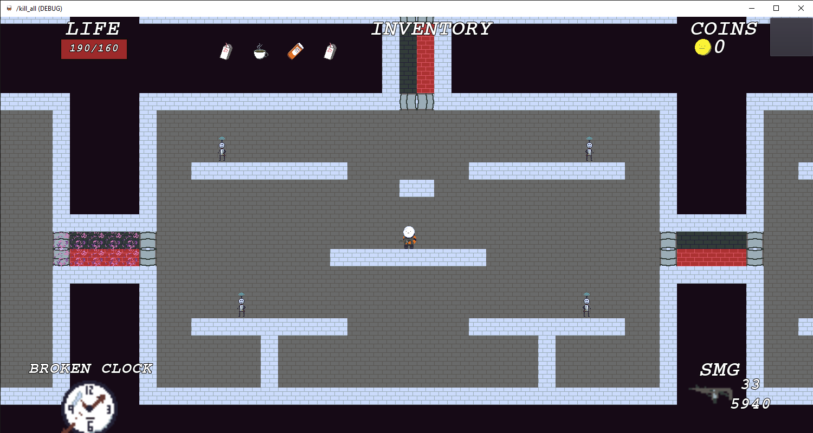
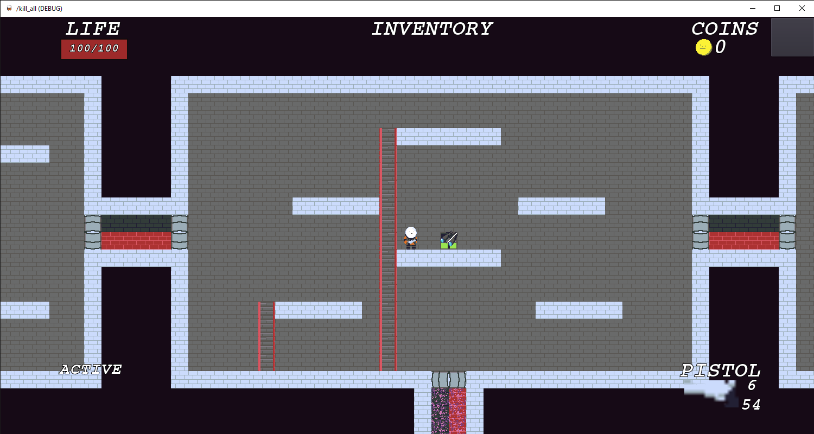
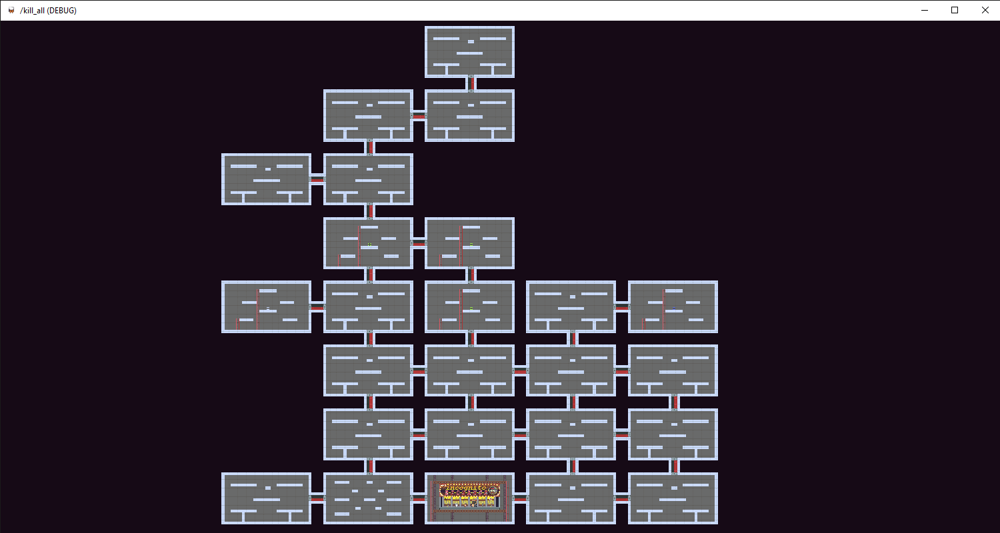

# Untitled Space Station Game

1[game screenshot 4](k4.png)

# 2022-08-09 Update
This was a game that I made during my first year of university. At the time, we were only learning introductory Java concepts, but I had already learned Java in
high school and wanted to do more. This game is a dungeon crawler that is a loose hybrid of both Risk of Rain and Enter the Gungeon. I had never coded a proper game
before. I figured I would start with a dungeon crawler because I would learn about procedural generation, enemy AI, character movement controls, and adding 
permanent and temporary effects to the player.

Being my first project in Godot, there were many poorly thought out design choices. In particular, the game is a platformer, but the player does not necessarily spawn at the top. Instead of amending this poor design choice, I had implemented "vacuum tiles" that pull the player through doors. Originally, this game was supposed to generate rooms not necessarily on a grid, to allow for interesting room designs and dungeon layouts, but this ended up working poorly with the vacuum tiles, so it was dropped.

I think that I stopped updating the game due to a lack of interesting ideas, as it was very derivative and had a lot of problems. Perhaps it was actually a scale issue instead. Roguelike games require a lot of enemy variety and items to keep players engaged, and that was a lot of work for a single developer.

<h3>Game Identity:</h3>
  
32-bit plat-former/dungeon crawler about a soldier fighting through a labyrinth of machines sent to destroy him and all life on the ship he’s on.

<h3>Design Pillars:</h3>
  
Escalating power. Claustrophobic. Non-linear choices.

<h3>Mechanics:</h3>
  
Game uses rogue-like elements, procedural generated layouts, and a random item system. As you progress further into the ship, enemies become more powerful as the sys_admin prepares to fight you. Power-ups are permanent or multi-use active items that stack infinitely.

<h3>Features:</h3>
  
Infinite stacking of items, procedurally generated rooms, random items. A feeling that you could always become stronger, and a chance to acquire a large inventory of stacking items rather quickly.

<h3>Interface:</h3>
  
Standard WASD controls for movement, mouse to aim and shoot. Menu and inventory is controlled through GUI elements. Game pad controls will also be added.

<h3>Art Style:</h3>
  
Shovel Knight for lighter character designs, Axiom Verge for the limited tile set and beautiful background tiles. Light-hearted feel despite the circumstances, like Isaac.

<h3>Music Style / Sound Design:</h3>
  
Sounds should illicit a sense of dread in a way, and boss fights should pick up the sound and create a sense of urgency.

<h3>Road Map:</h3>
<ul>
  <li>Mechanics Complete – 07/01/19</li>
  <li>Enemies Complete – 07/15/19</li>
  <li>Items Complete - 07/22/19</li>
  <li>Boss Fights Complete - 08/01/19</li>
</ul>
